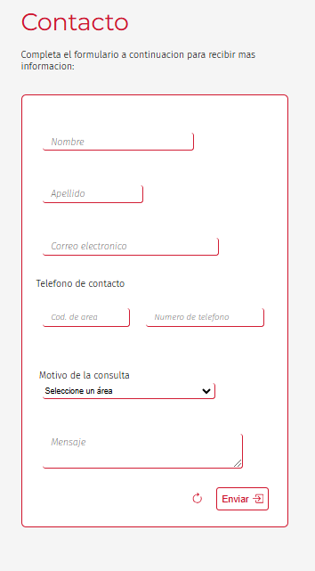
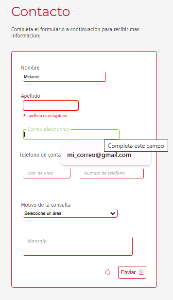

# 📬 Formulario de Contacto

Este proyecto es un formulario de contacto responsive y estilizado con HTML y CSS. Está diseñado para brindar una experiencia moderna, clara y profesional al usuario.

---

## 🧱 Estructura del Proyecto

- `index.html`: contiene la estructura del formulario.
- `styles.css`: define estilos visuales, animaciones y diseño responsive.
- `script.js`: gestiona las validaciones y el comportamiento del modal.

---

## 🚀 Tecnologías Utilizadas

- **HTML5**: estructura semántica.
- **CSS3**: estilos avanzados, animaciones y diseño responsive.
- **JavaScript**: lógica de validación y control del modal.

---

## 🎨 Estética Tipográfica y Paleta de Colores

### ✒️ Tipografías

Se utilizaron dos fuentes con el fin de transmitir claridad y estilo:

- **Montserrat**: para los títulos. Tiene un estilo moderno y geométrico le da presencia y profesionalismo al formulario.
- **Fira Sans**: para el cuerpo del formulario, ya que tiene una buena legibilidad en pantalla.

### 🌈 Colores

- **Tonos neutros** (blancos, grises suaves): usados como base para mantener un diseño limpio y profesional.
- **Color principal (Rojo tenue)**: aplicado en titulo, botones e interacciones, me parecio un color elegante y que sigue la linea profesional.

El objetivo fue que el diseño sea **accesible, moderno y sobrio**.

---

## 🧩 Justificación del Diseño y Desarrollo

### ✅ Variables CSS

Se usan variables en `:root` para manejar colores, fuentes y pesos de manera centralizada, permitiendo mantener coherencia visual y facilidad de mantenimiento.

---

### ✅ Inputs flotantes

Los inputs utilizan etiquetas flotantes que se animan cuando el usuario escribe o hace foco. 

---

### ✅ Validación visual

Cuando un campo no se completa correctamente, cambia el estilo del input y se muestra un mensaje de error debajo, esto da una mejor experiencia ya que el usuario puede ver el error en tiempo real.

---

### ✅ Modal animado

Una ventana modal aparece para confirmar el envío del formulario, utiliza animaciones.

---

### ✅ Diseño responsive

Se utiliza flexbox y media queries para adaptar el diseño a pantallas pequeñas. El formulario mantiene su funcionalidad y estética en dispositivos móviles.

---

## 🖼 Vista previa del diseño 

> 📸 
> 
> 

---

## 🤝 Autor

Trabajo realizado por **Melanie San Román** 💻  
